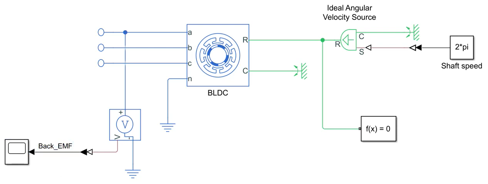

# Simulating Back-EMF Voltage of a BLDC Motor
### Copyright 2019 The MathWorks, Inc.

This repository contains the Simulink model used in the [How to Design Motor Controllers Using Simscape Electrical, Part 1: Simulating Back-EMF Voltage of a BLDC Motor](https://www.youtube.com/watch?v=JDgvBZbnfPw&list=PLn8PRpmsu08pqegLB5CqfgZCtuK5UKIrx) video. Check out the rest of the videos in [this section](#videos).

## Model & Setup
The provided model shown below lets you simulate a three-phase BLDC motor and observe its back-EMF voltage. 

In this simulation, we create a scenario where we turn the motor shaft while having open terminals at all three phases and then measure the voltage produced at one of the phases to observe the back-EMF which is shown in the below picture.

To run the simulation, open the “BLDC_back_EMF” Simulink model, run simulation by pressing the “Run” button on the simulation tab and observe the back-EMF voltage using the provided scope.

## Videos & Files
"How to Design Motor Controllers Using Simscape Electrical" video series consists of 5 videos. Click the links below to watch the videos and download the files. 

  - Part 1: Simulating Back-EMF Voltage of a BLDC Motor [[Watch video](https://www.youtube.com/watch?v=JDgvBZbnfPw&list=PLn8PRpmsu08pqegLB5CqfgZCtuK5UKIrx&index=1), [Download files](https://github.com/mathworks/Design-motor-controllers-with-Simscape-Electrical/tree/master/1%20Simulating%20back%20emf%20voltage%20of%20a%20BLDC%20motor)]
  - Part 2: Modeling a Three-Phase Inverter [[Watch video](https://www.youtube.com/watch?v=dghUC_IAj1Q&list=PLn8PRpmsu08pqegLB5CqfgZCtuK5UKIrx&index=2), [Download files](https://github.com/mathworks/Design-motor-controllers-with-Simscape-Electrical/tree/master/2%20Modeling%20a%20three%20phase%20inverter)]
  - Part 3: Modeling Commutation Logic [[Watch video](https://www.youtube.com/watch?v=NH0O1-mjysU&list=PLn8PRpmsu08pqegLB5CqfgZCtuK5UKIrx&index=3), [Download files](https://github.com/mathworks/Design-motor-controllers-with-Simscape-Electrical/tree/master/3%20Modeling%20commutation%20logic)]
  - Part 4: Model PWM-Controlled Buck Converters [[Watch video](https://www.youtube.com/watch?v=bMJVmyv76Bs&list=PLn8PRpmsu08pqegLB5CqfgZCtuK5UKIrx&index=4), [Download files](https://github.com/mathworks/Design-motor-controllers-with-Simscape-Electrical/tree/master/4%20Modeling%20a%20PWM%20controlled%20buck%20converter)]
  - Part 5: An Alternative implementation of PWM Control [[Watch video](https://www.youtube.com/watch?v=_abK4wVDL4Y&list=PLn8PRpmsu08pqegLB5CqfgZCtuK5UKIrx&index=5), [Download files](https://github.com/mathworks/Design-motor-controllers-with-Simscape-Electrical/tree/master/5%20PWM%20control%20of%20a%20BLDC%20motor)]
  
Check out [this tech talk video series](https://www.youtube.com/playlist?list=PLn8PRpmsu08qL-EG3DRMtRyokpXQJyhp7) to understand: 
  
- How brushless DC motors differ from brushed DC motors and how they work
- How BLDC motors can be controlled using six-step commutation (trapezoidal control)
- The different components of a BLDC motor control algorithm such as PWM control, commutation logic, three-phase inverter and sensor. 

